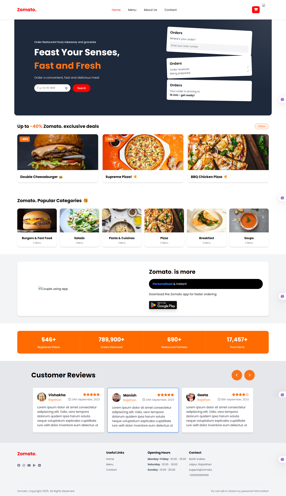
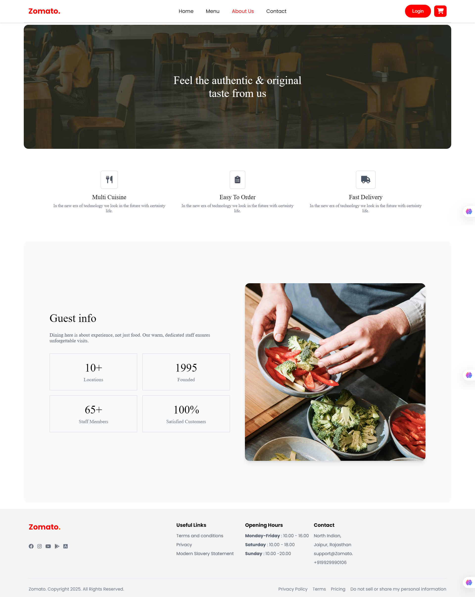
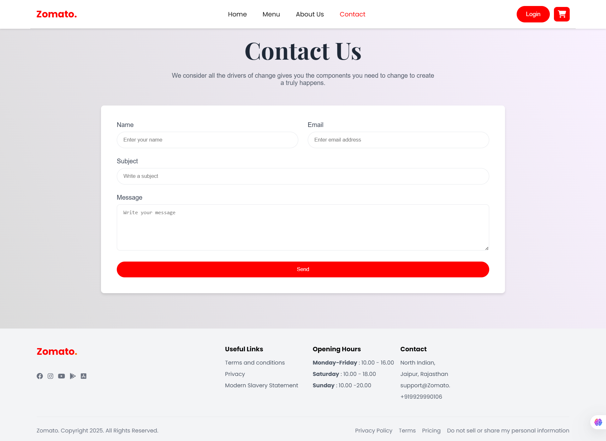
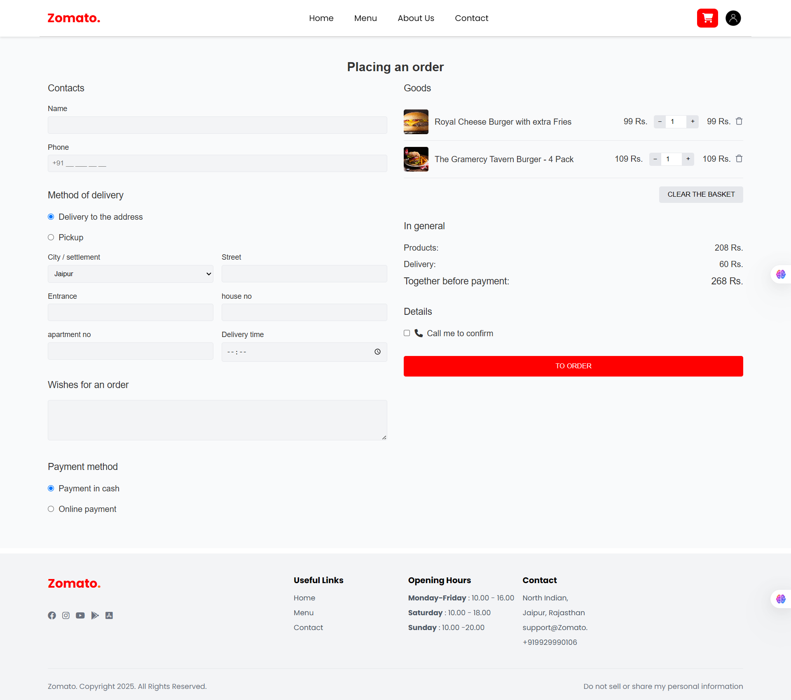
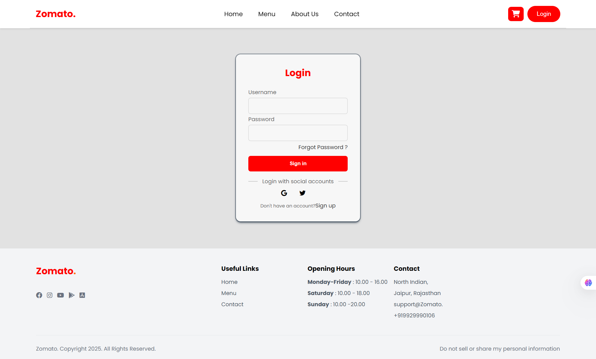

# 🍔 Food Delivery - MERN Stack Project

### 🔗 Live Website: https://food-delivery-sit.netlify.app/ 
This is a **Food Delivery Web Application** built using the **React Js**
## 📸 Screenshots

### 🔹 Home Page


### 🔹 Menu Page


### 🔹 About Us Page


### 🔹 Contact Page


### 🔹 Cart Page


### 🔹 Login Page


## 🚀 Installation & Setup

### 1️⃣ Clone the Repository
```sh
git clone https://github.com/nikhil566565/Food-Delivery.git
```

### 2️⃣ Navigate to the project folder:
```sh
cd Food-Delivery
```

### 3️⃣ Install dependencies:
```sh
npm install
npm install @fortawesome/react-fontawesome @fortawesome/free-solid-svg-icons

```

### 4️⃣ Start the development server:
```sh
npm start
```

## 📬 Contact Me

💻 **GitHub**: [nikhil566565](https://github.com/nikhil566565)  
📩 **Email**: nikhilkumawat7689@gmail.com  


